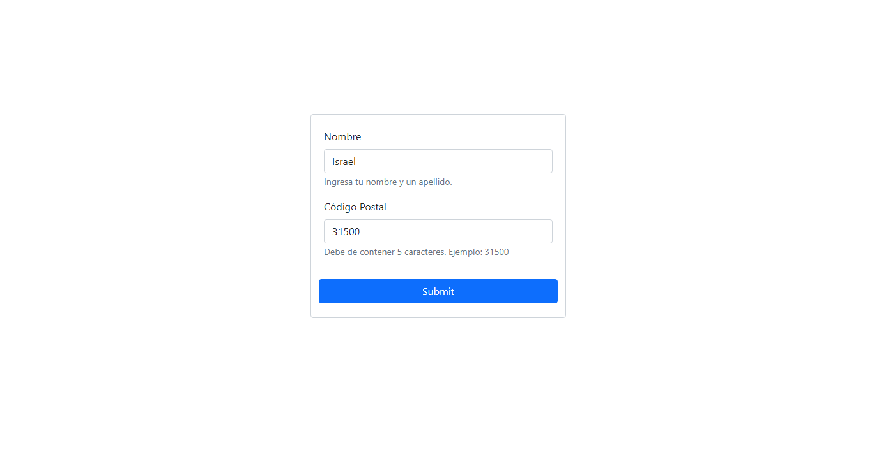

## Código Postal con PHP y MySQL

Vemos que el código postal consta de 5 números los cuales los dos primeras cifras representan la provincia por orden alfabético, ya con ello podremos saber la provincia en la que están

La tercera cifra indica el encaminamiento;
El cuarto dígito representa la ruta;
El quinto dígito representa el reparto.

Casos Especiales ---- No son redundantes pero los debemos de tener en cuenta
En cada capital de provincia existen unos códigos reservados para usos especiales:
070 para correspondencia oficial de Correos y Telégrafos
071 para correspondencia de organismos oficiales
080 para apartados y lista de correos

## Demo: [Preview](http://codigopostal.epizy.com/postal-code/)